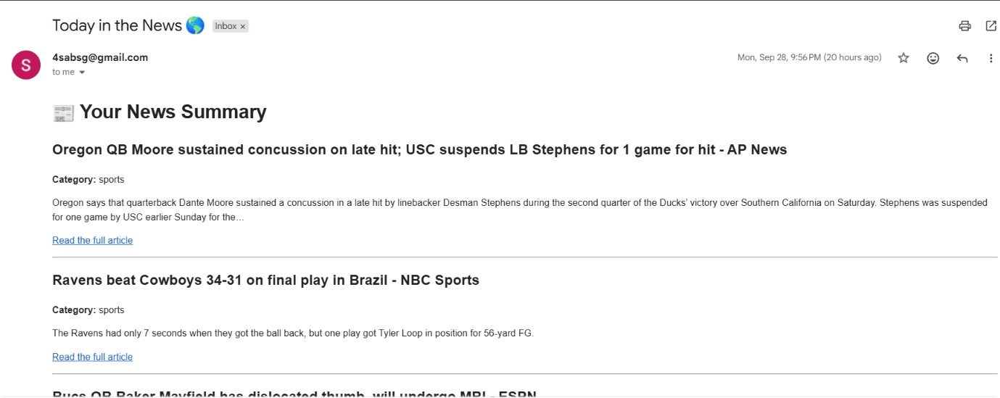
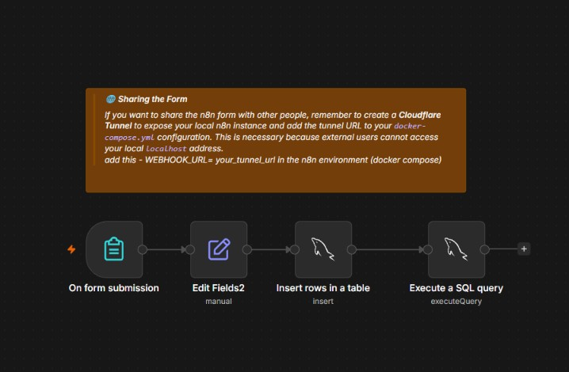
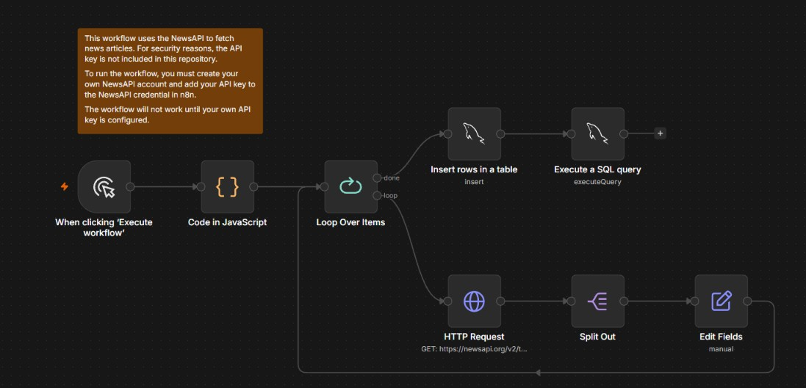

# nl-n8n — Personalized News Newsletter with n8n

An automated newsletter built with [n8n](https://n8n.io), MySQL and Docker. Users sign up through a form and choose the news categories they care about. The system collects articles from [NewsAPI](https://newsapi.org), stores them in MySQL, and emails each subscriber a summary of the news in their categories.



## How it works

The project is made of three n8n workflows:

| Workflow | Purpose |
|---|---|
| `add_user` | Registers a new subscriber from an n8n form |
| `collect_news` | Fetches articles from NewsAPI and saves them to MySQL |
| `send_email` | Builds and sends each subscriber their personalized email |

### 1. `add_user`



1. **On form submission** — an n8n form collects the subscriber's name, email, preferred news category and email frequency.
2. **Edit Fields** — formats the submitted values to match the `users` table columns.
3. **Insert rows in a table** — saves the subscriber in the `users` table.
4. **Execute a SQL query** — runs any follow-up query on the database.

> **Sharing the form:** to let other people use the form, expose your local n8n instance with a **Cloudflare Tunnel** and add the tunnel URL to `docker-compose.yml`:
>
> ```yaml
> environment:
>   - WEBHOOK_URL=your_tunnel_url
> ```
>
> External users cannot reach your `localhost` address.

### 2. `collect_news`



1. **Manual trigger** — starts the workflow with *Execute workflow*.
2. **Code in JavaScript** — prepares the list of items (categories) to fetch.
3. **Loop Over Items** — iterates over each item.
   - **HTTP Request** — `GET` to the NewsAPI top-headlines endpoint.
   - **Split Out** — turns the returned `articles` array into individual items.
   - **Edit Fields** — keeps only the fields needed (title, description, URL, category, source, publication date).
4. When the loop finishes (**done**):
   - **Insert rows in a table** — stores all collected articles in the `news` table.
   - **Execute a SQL query** — post-processing on the stored data.

### 3. `send_email`


1. **Manual trigger** — starts the workflow.
2. **Execute a SQL query** — retrieves the subscribers from the `users` table.
3. **Loop Over Items** — for each subscriber:
   - **Execute a SQL query1** — fetches from the `news` table the articles that match that subscriber's category.
   - **Summarize** — aggregates the articles.
   - **Code in JavaScript** — builds the HTML body of the email.
   - **Send an Email** — sends the message via SMTP.

Each email is titled **"Today in the News 🌎"** and contains the article title, category, a short description and a link to the full article.

## Database

The project uses **MySQL**. The tables are created automatically by the script in the `mysql/` folder the first time the container starts.

**`users`** — one row per subscriber

| Column | Description |
|---|---|
| `id` | Auto-incremented primary key |
| `name` | Subscriber's name |
| `email` | Subscriber's email address (unique, so nobody can sign up twice) |
| `category` | News category the subscriber chose (e.g. sports) |
| `frequency` | How often the subscriber wants to receive the newsletter |
| `created_at` | Sign-up timestamp, filled in automatically |

**`news`** — one row per collected article

| Column | Description |
|---|---|
| `id` | Auto-incremented primary key |
| `title` | Article headline |
| `description` | Short summary or excerpt of the article |
| `url` | Link to the full article |
| `category` | Category the article was fetched for; used to match articles to subscribers |
| `source` | Publisher name (e.g. AP News, ESPN) |
| `published_at` | When the article was published |
| `collected_at` | When the article was collected, filled in automatically |

## Project structure

```
nl-n8n/
├── docker-compose.yml   # n8n + MySQL services
├── mysql/
│   └── init.sql         # database and table initialization
├── screenshots/         # workflow and email screenshots used in this README
├── .gitattributes
└── README.md
```

## Requirements

- [Docker](https://www.docker.com/) and Docker Compose
- A free [NewsAPI](https://newsapi.org) account and API key
- SMTP credentials (for example, a Gmail account with an app password)
- *(Optional)* a Cloudflare Tunnel, to share the signup form publicly

## Getting started

1. **Clone the repository**

   ```bash
   git clone <your-repo-url>
   cd nl-n8n
   ```

2. **Start the containers**

   ```bash
   docker compose up -d
   ```

   The MySQL container runs the script in `mysql/` on first start to create the database and tables.

3. **Open n8n** at [http://localhost:5678](http://localhost:5678) and create your owner account.

4. **Import the workflows** (`add_user`, `collect_news`, `send_email`) through *Workflows → Import from file*.

5. **Configure your credentials in n8n.** API keys and passwords are not included in this repository for security reasons. If you fork it, you must provide your own:

   - **NewsAPI key** — used by the HTTP Request node in `collect_news`
   - **MySQL credentials** — used by every MySQL node (host is the MySQL service name from `docker-compose.yml`)
   - **Email/SMTP credentials** — used by the Send Email node in `send_email`

6. **Run the flow in order:**
   1. Activate `add_user` and sign up a few users through the form.
   2. Run `collect_news` to fill the database with articles.
   3. Run `send_email` to deliver the newsletters.

## Notes

- The workflows will not work until your own credentials are configured.
- `WEBHOOK_URL` must be set in the n8n environment if the form is shared outside your machine.
- NewsAPI's free plan has request limits, so keep the number of categories reasonable.

## Tech stack

n8n · MySQL · Docker Compose · NewsAPI · SMTP · JavaScript (n8n Code nodes)
